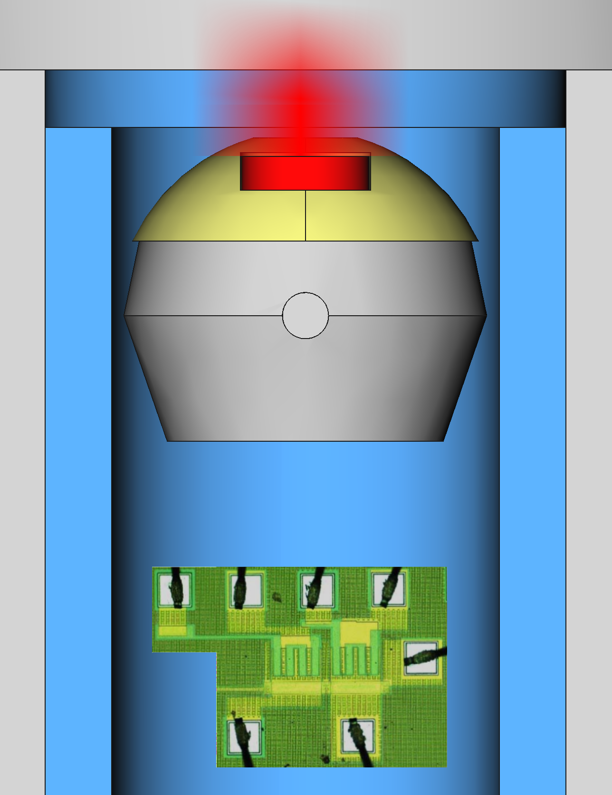
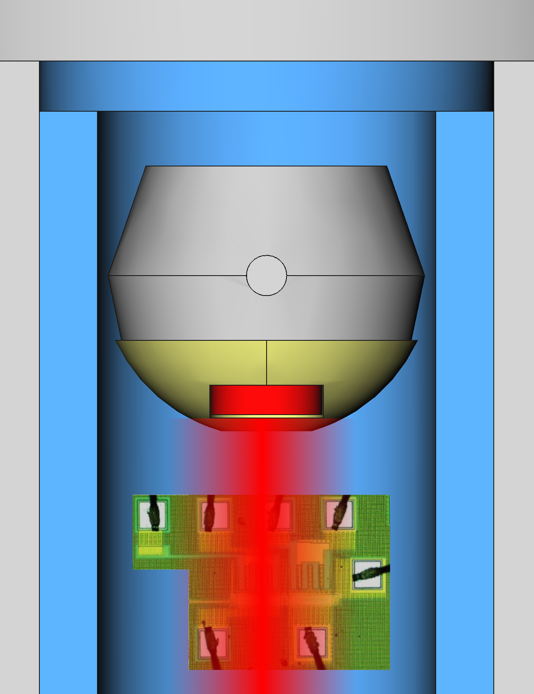

% Diseño y caracterización de dosímetros MOS
% Ignacio Martinez
% Diciembre 2018
<!--

* Priorizar interesante, no necesariamente cubrir todo

* Acentuar y dedicarle tiempo a las motivaciones generales y de cada tema

* No muchas diapos, ir lento, explicar cada gráfico

* Terminar con resumen de los logros y sugerencias para su continuación.

* Preparar ensayo en el laboratorio con tiempo para adaptar las sugerencias

• goal/objectives of the research (2 min)
• literature review/theoretical framework (5 min)
• methodology (5 min)
• findings (10 min)
• recommendations (5 min)

-->
# Introducción

## Qué es la radiación?

Partículas que transportan energía

{.quarterwidth}

## Daño a tejidos y circuitos

{.halfwidth}
{.halfwidth}

## Usos médicos

Diagnóstico y terapia

{.quarterwidth}
{.halfwidth}

## Usos industriales

Ensayos no destructivos

{width=40%}

{width=70%}

## Dosimetría

{width=85%}

## Dosímetros

{width=20%}

# Radiación en dispositivos

## Transitorios de carga

{width=70%}

## Defectos cristalinos

{width=70%}

## Radiación en Óxido de MOS

{width=70%}

# Experimental

## Irradiador

{width=70%}

## Funcionamiento

{width=35%}
{width=35%}

## Espectro de la fuente

Actividad nominal: 100\ mCi
{width=80%}

## Simulación Monte Carlo

:::::::::::::: {.columns}
::: {.column width="50%"}
* Toolkit Geant4
* Lista de procesos para microelectrónica
    * Electrones secundarios hasta 16.7\ eV (rango 0.1\ nm)
* Geometría simplificada para acelerar simulación
:::
::: {.column width="50%"}
{width=100%}
:::
::::::::::::::

## Resultados

{width=80%}

# Dosímetro APS

## Esquemático

{width=60%}

## Construcción
:::::::::::::: {.columns}
::: {.column width="70%"}
* Proceso CMOS de 0.6\ µm, 5\ V
* 1 polisilicio, 2 metales
* PDK para Mentor
:::
::: {.column width="30%"}
{width=100%}
:::
::::::::::::::
{width=80%}

## Cálculos Monte Carlo

Geometría simplificada

{width=50%}

## Resultados

{width=60%}

## Exposición a luz visible

{width=60%}

## Ruido intra-disparo

{width=60%}

## Ruido inter-disparos

{width=60%}
