% Diseño y caracterización de dosímetros MOS
% Ignacio Martinez
% Diciembre 2018
<!--

* Priorizar interesante, no necesariamente cubrir todo

* Acentuar y dedicarle tiempo a las motivaciones generales y de cada tema

* No muchas diapos, ir lento, explicar cada gráfico

* Terminar con resumen de los logros y sugerencias para su continuación.

* Preparar ensayo en el laboratorio con tiempo para adaptar las sugerencias

• goal/objectives of the research (2 min)
• literature review/theoretical framework (5 min)
• methodology (5 min)
• findings (10 min)
• recommendations (5 min)

-->
# Introducción

## Qué es la radiación?

Partículas que transportan energía

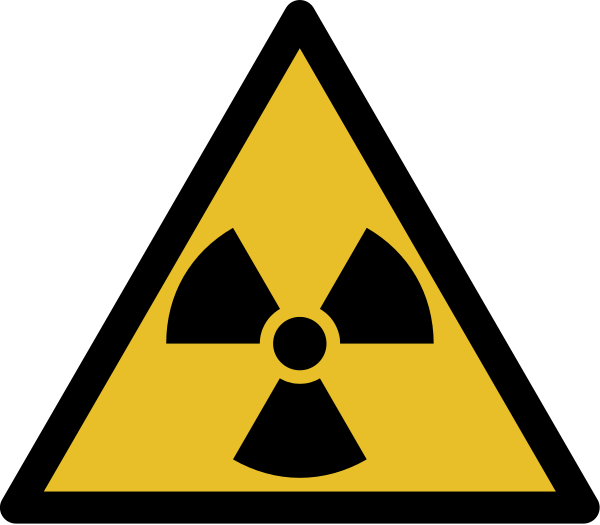{.quarterwidth}

## Daño a tejidos y circuitos

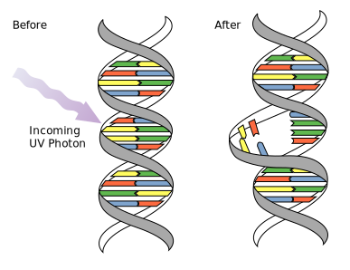{.halfwidth}
{.halfwidth}

## Usos médicos

Diagnóstico y terapia

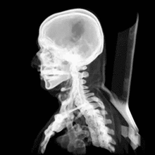{.quarterwidth}
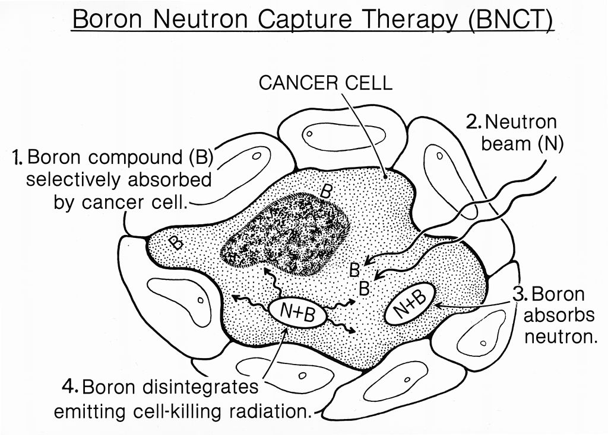{.halfwidth}

## Usos industriales

Ensayos no destructivos

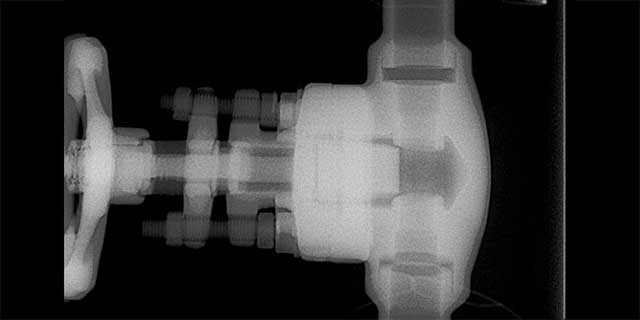{width=40%}

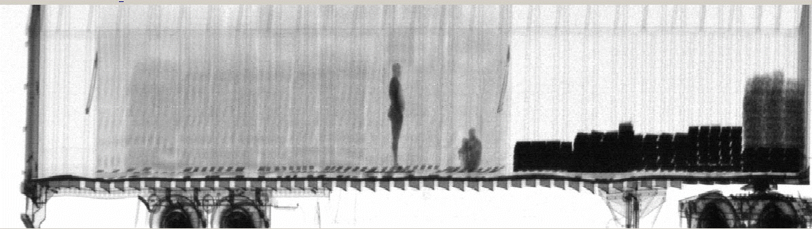{width=70%}

## Dosimetría

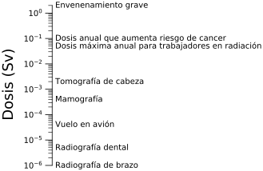{width=85%}

## Dosímetros

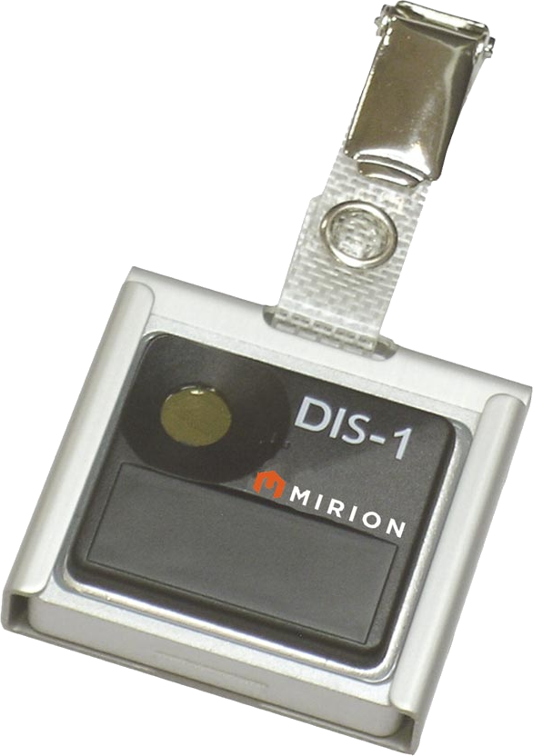{width=20%}

# Radiación en dispositivos

## Transitorios de carga

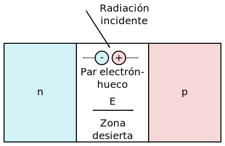{width=70%}

## Defectos cristalinos

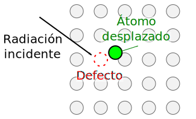{width=70%}

## Radiación en Óxido de MOS

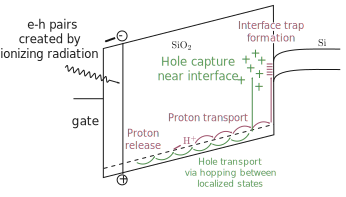{width=70%}

# Experimental

## Irradiador

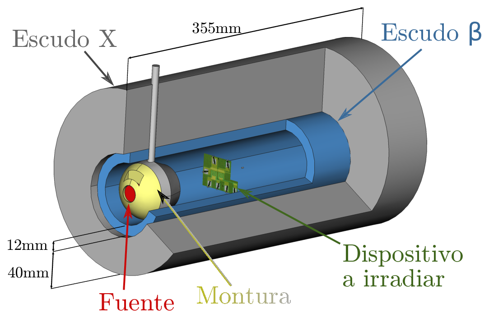{width=70%}

## Texto al lado de imagen

:::::::::::::: {.columns}

::: {.column width="40%"}
:::

::: {.column width="60%"}
contents derecha $$x^2$$
:::

::::::::::::::

## Conclusiones

* Esta

* Y esta

